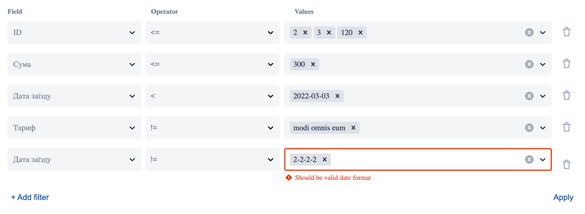

# table-filters-client

table-filters-client is React.js library for flexible filters.

You could create multiple filters for table

Here you could find server part of these filters, by AND48
https://github.com/AND48/table-filters

## Installation

```bash
 yarn add table-filters-client
```

or

```bash
 npm install table-filters-client
```

Live example here [CodeSandbox](https://codesandbox.io/s/thirsty-smoke-bjc84n?file=/src/App.js)


## Preview




## Usage

```typescript jsx
import React from 'react';
import { navigate, location } from 'react-router-dom';
import { TableFiltersClient, FilterResponseItem, InitialFiltersWithoutExtraData } from 'table-filters-client';
import '../node_modules/table-filters-client/dist/index.css';
import { stringifyUrl, parseUrl } from './helpers'; // you could find functions below

interface Response {
  data: Array<any>; // the <Table /> component is coming soon
  meta: {
    filters: Array<FilterResponseItem>;
    pagination: any;
  };
}

interface ResponseSource {
  data: Array<{
    id: number;
    name: string;
  }>;
  meta: {
    loadMore: boolean;
  };
}

const FiltersTable = () => {
  const navigate = useNavigate();
  const location = useLocation();
  const [filters, setFilters] = useState<Array<FilterResponseItem>>([]);

  useEffect(() => {
    fetch('/reservation')
      .then((response) => response.json())
      .then((data: Response) => {
        setFilters(data.meta.filters);
      });
  }, []);

  // pagination and search for select (values) when type === 'source'
  const onLoadSourceOptions = (filterId: string) => {
    
    // types for params you could find in react-select-async-paginate module
    return async (inputValue, prevOptions, { page }) => {
      const response = await fetch(`/filters/${filterId}/source-data?query=${inputValue}&page=${page}`);
      const data: ResponseSource = await response.json();

      return {
        options: data.options, // [{ value, label }]
        hasMore: data.hasMore,
        additional: {
          page: page + 1,
        },
      };
    };
  };

  // receive filters from url
  const initialFilters = parseUrl<InitialFiltersWithoutExtraData>(queryString.slice(1));

  const submitForm = (data: InitialFiltersWithoutExtraData) => {
    // fetch data by using filter result

    // save filters to url
    navigate(`?${stringifyUrl(data)}`);
  };

  return (
    <TableFiltersClient
      onAddFilter={() => {
        /* do something after new filter will has added */
      }}
      onRemoveFilter={() => {
        /* do something after some filter will has deleted */
      }}
      onSubmitFilterForm={submitForm} /*  submit */
      initialFilters={initialFilters} /* from url or localstorage */
      filtersTypesList={filters} /* list from server */
      onLoadSourceOptions={onLoadSourceOptions}
      idLabelText="Field"
      operatorLabelText="Operator"
      valuesLabelText="Values"
      addFilterButtonText="+ Add filter"
      submitFilterButtonText="Apply"
      RemoveFilterButton={() => <button>Remove this</button>}
      AddFilterButton={() => <button type="button">Add Filter</button>}
      SaveFilterButton={() => <button>Save Filter</button>}
      validationMessages={{
        required: 'required',
        date: 'Should be date',
        string: 'should be string',
        number: 'should be number',
      }}
    />
  );
};
```

if you use https://github.com/AND48/table-filters package

data.meta.filters in useEffect will return data as below and exactly data expected for `<TableFiltersClient filtersTypesList={...}/>`

```javascript
[
  {
    caption: 'ID',
    id: 1,
    operators: ['<', '<=', '>', '>=', '=', '!='],
    type: 'number', // number, string, source, date, enum,
    values: null, // null or [{ id: '', name: '' }]
  },
];
```

If `type === 'enum'` then values will be an array of objects as below

```javascript
[
  { id: '1', name: 'Approved' },
  { id: '2', name: 'Reject' },
];
```

If `type === 'string' && type === 'number' && type === 'date'` then values will be `null` and we will be able to fill in the field ourselves

If `type === 'source'` then when click to 'values' select it would call `onLoadSourceOptions` where we would get array dynamically

`onSubmitFilterForm` return values as below. And `initialFilters` object looks the same

```javascript
{
  filters: [
    {
      id: {
        label: 'Status',
        value: '1',
      },
      values: [
        {
          label: 'Approved',
          value: '12',
        },
      ],
      operator: '=',
    },
  ];
}
```

You could save filters as query string or in localStorage

I use https://www.npmjs.com/package/qs package for save it

`./helper.ts`

```typescript
import { IParseOptions, IStringifyOptions, stringify, parse } from 'qs';

export const stringifyUrl = function <T>(obj: T, options?: IStringifyOptions): string {
  return stringify(obj, options);
};

export const parseUrl = function <R>(queryParams: string, options?: IParseOptions & { decoder?: never | undefined }): R {
  return parse(queryParams, options) as unknown as R;
};
```


style your forms by using css var

```scss
.filter-list {
  --grid-gap-column: 24px;
  --grid-gap-row: 18px;
  --grid-label-size: 14px;
  --grid-label-color: rgba(9, 30, 66, 0.8956);


  --error-color: #C42B1C;
  --focus-color: #005FB8;

  --field-border-error-color: rgba(9, 30, 66, .2);
  --field-border-focus-color: rgba(9, 30, 66, .2);
  --field-border-default-color: rgba(9, 30, 66, .2);
  --field-background-default: white;
  --field-background-error: white;
  --field-background-focus: white;
  --field-min-height: 32px;
  --field-border-radius: 3px;
  --field-shadow: none;
  --field-shadow-focus: inset 0px -2px 0 0 var(--focus-color);
  --field-shadow-error: inset 0px -2px 0 0 var(--error-color);


  // multiple select style
  --field-multiple-value-size: 12px;
  --field-multiple-value-color: rgba(9, 30, 66, 0.8956);
  --field-multiple-value-background: rgba(9, 30, 66, 0.0373);
  --field-multiple-value-remove: rgba(9, 30, 66, 0.6063);

  --field-multiple-value-background-clear: white;
  --field-multiple-value-color-clear: black;


  // fields (single select, select)
  --field-value-size: 14px;
  --field-value-color: rgba(9, 30, 66, 0.8956);
  --field-dropdown-arrow: rgba(9, 30, 66, 0.6063);

  // switcher style
  --switcher-background-unchecked: #dfe1e6;
  --switcher-background-checked: #005FB8;
  --switcher-value-color: rgba(9, 30, 66, 0.8956);

}
```